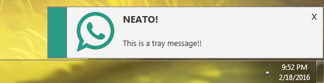

## About
JavaFX Toast Notifications à la carte.



JToast is a Java class created with JavaFX used to create toast notifications on the user’s screen. You may integrate these into your own Java/JavaFX programs.

## Features
- Easy to integrate into any Java/JavaFX project.
- Three built-in animation types: Pop, Fade, and Slide.
- The ability to create your own animation types!
- Support for custom images

## Usage 

```java
// Create a new JToast

        String title = "HEY YOU!";
        String message = "JToast is the coolest toast app ever!";
        Notification notification = Notifications.SUCCESS;

        JToast tray = new JToast();
        tray.setTitle(title);
        tray.setMessage(message);
        tray.setNotification(notification);
        tray.showAndWait();

```


## ToDo
- Demo program
- More documentation!
